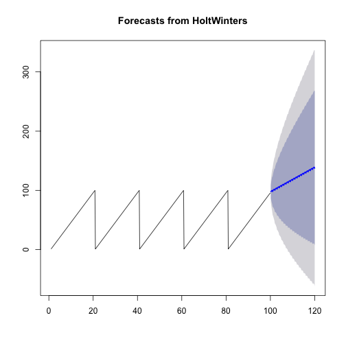

## What the app is about?

The application is designed to predict anomalies in temperature for any given day and location.

The application forecasts the temperature deviation on a given day from the historical mean.

The application uses HoltWinters method from 'forecast' package in R for forecasting. 

--- 

## Assumptions

Enigma.io provides data from 1964 to 2013. Data after 2012 has been used for this app. This is done so that the model trains on a relevant dataset. 

The dataset reports the days for which the temperature shows a deviation from the historical average value.
Thus the temperature for the remaining days are considered to be in the range of the historical average. For these days we set the deviation from the mean to 0. 

In the next slide we show a basic example to demonstrate the Time Series model building and forecasting.

---

## Example showing Time Series Forecasting

Fitting a time series model on generated data


```r
x <- seq(1:100)
timeSeries <- ts(x, start = 1, end = 100, frequency = 5)
fit <- HoltWinters(timeSeries)
forecast(fit, 3)
```

```
##       Point Forecast    Lo 80    Hi 80    Lo 95    Hi 95
## 100.2       97.80354 86.30515 109.3019 80.21827 115.3888
## 100.4       98.87447 82.67983 115.0691 74.10690 123.6420
## 100.6       99.45756 79.63201 119.2831 69.13699 129.7781
```

---

## Plot showing the forecast for the next 100 future values

```r
plot(forecast(fit, 100))
```

 
